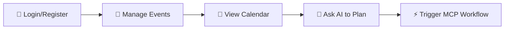

<div align="center">

# 🗓️ Arandu MVP

## AI-Assisted Scheduling Web App

<p align="center">
  <em>A modern Next.js application that revolutionizes event planning with AI-powered scheduling assistance and intelligent workflow automation.</em>
</p>

<p align="center">
  <a href="https://nextjs.org/">
    
  </a>
  <a href="https://www.typescriptlang.org/">
    
  </a>
  <a href="https://tailwindcss.com/">
    
  </a>
</p>

</div>

---

## 🚀 Overview

**Arandu** empowers users to seamlessly plan and manage events through an
intuitive calendar interface, enhanced by AI assistance that can generate and
refine schedules.

The application features:

- 🔒 **Robust authentication**
- 📊 **Comprehensive event management**
- 🤖 **Intelligent AI workflows**
- 🔗 **External tool integration**

All designed to boost productivity and streamline event planning.

---

## ✨ User Journey



**Flow:**
`Login/Register → Manage Events → View Calendar → Ask AI to Plan → Trigger MCP Workflow`

---

## 🎯 Key Features

### 🔐 Authentication & Security

- 🍪 Secure session management via cookies
- 🛡️ Protected routes with middleware
- 🔄 Session forwarding to backend APIs

### 📅 Event Management

- ➕ Create, view, and delete events for specific days and ranges
- 🗓️ Calendar UI with intuitive day and month navigation
- ⚡ Real-time updates with cache invalidation

### 🤖 AI-Powered Planning

- 🧠 Intelligent scheduling based on user context
- 🎯 Schedule optimization and refinement
- 💬 Natural language event planning

### 🔗 MCP Workflow Integration

- 🌐 External tool integration (News API, Email services)
- 📧 Automated reporting and notifications
- 🔧 Extensible workflow system

### ⚡ Performance & UX

- 🏷️ Cache tags for selective data revalidation
- ⚙️ Server Components for optimal performance
- 📱 Responsive design with Tailwind CSS

---

## 🛠️ Getting Started

### 📋 Prerequisites

Before you begin, ensure you have:

- 📦 **Node.js 18+**
- 🔧 **npm** (or pnpm/yarn)
- 🌐 **Configured backend/API**

### 🚀 Installation

```bash
# 📥 Clone and install dependencies
npm install

# 🔥 Development with Turbopack
npm run dev

# 🏗️ Production build
npm run build
npm start
```

---
